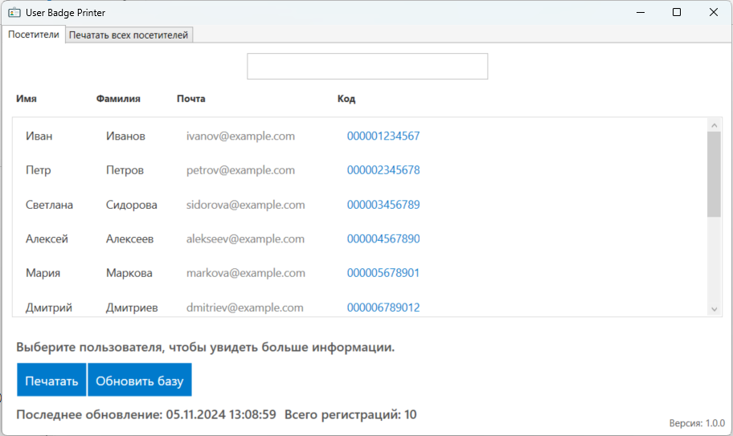

# User Badge Printer

**User Badge Printer** — это удобное и функциональное приложение для управления и печати бейджей пользователей. Разработанное на платформе WPF с использованием C#, оно предоставляет интуитивно понятный интерфейс для работы с данными пользователей, их поиска, выбора и печати.

## Основные функции

- **Загрузка данных**: Автоматическая загрузка данных пользователей с удаленного сервера и сохранение их в локальный файл для последующего использования.
- **Поиск пользователей**: Быстрый поиск пользователей по имени, фамилии или email.
- **Выбор и печать**: Возможность выбора одного или нескольких пользователей для печати бейджей, а также печать всех пользователей сразу.
- **Обновление данных**: Обновление данных пользователей в один клик.
- **Интерфейс**: Удобный и интуитивно понятный интерфейс с использованием вкладок для разделения функций.

## Технологии

- **WPF**: Для создания пользовательского интерфейса.
- **C#**: Основной язык программирования.
- **HttpClient**: Для взаимодействия с удаленным сервером.
- **Newtonsoft.Json**: Для десериализации JSON данных.
- **RawPrinterHelper**: Для отправки команд на принтер.

## Преимущества

- **Удобство использования**: Простой и понятный интерфейс.
- **Быстрая работа**: Эффективные алгоритмы поиска и фильтрации данных.
- **Гибкость**: Возможность выбора и печати как одного пользователя, так и всех сразу.

## Тестирование

Программа была протестирована с принтером **GoDEX GE300**. Рекомендуется использовать этот принтер для достижения оптимальных результатов печати.

## Размер и содержимое этикетки

- **Размер этикетки**: 80 x 50 мм
- **Содержимое этикетки**:
  - Фамилия и имя пользователя
  - Штрихкод

## Изображения

Вот несколько примеров интерфейса приложения и печатаемых этикеток:




## Установка

1. Склонируйте репозиторий:
   ```bash
   git clone https://gitflic.ru/project/hlopkov/user-badge-printer.git

2. Откройте проект в Visual Studio.

3. Соберите проект и запустите приложение.

## Использование

1. При первом запуске приложение загрузит данные пользователей с удаленного сервера.
2. Используйте строку поиска для нахождения нужного пользователя.
3. Выберите пользователей для печати и нажмите кнопку "Печать".
4. Для обновления данных нажмите кнопку "Обновить".

## Пример JSON данных
Программа принимает JSON с содержимым, например:
   ```bash
   [
  {
    "Id": 1,
    "first_name": "Иван",
    "last_name": "Иванов",
    "middle_name": "Иванович",
    "email": "ivanov@example.com",
    "code": "0000012345678"
  },
  {
    "Id": 2,
    "first_name": "Петр",
    "last_name": "Петров",
    "middle_name": "Петрович",
    "email": "petrov@example.com",
    "code": "0000023456789"
  },
  {
    "Id": 3,
    "first_name": "Светлана",
    "last_name": "Сидорова",
    "middle_name": "Сидоровна",
    "email": "sidorova@example.com",
    "code": "0000034567890"
  }
]
 ```

## Контакты
Если у вас есть вопросы или предложения, вы можете связаться со мной по электронной почте: jaroslav.hlopkov@gmail.com
